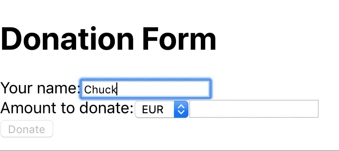
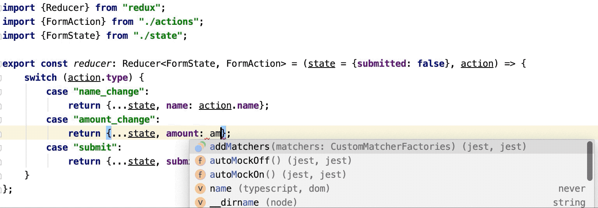

In the last two years I've been working with React and Redux in Typescript. Although Typescript
provides a powerful type checker, I often see developers not using it to its full potential.
Particularly, I think we can do better at defining the types of the Redux actions and states,
in order to get better type error detection, IDE autocompletion, safer refactoring, and expressiveness.

## Background ##

Let's start with an example. Let's say we want to implement a small donation form in which
people can fill in their name and the amount they want to donate. When they click *Donate*,
they get a thank you message. See the source code on [Github](https://github.com/sutiialex/type-safe-redux).



We have defined a controlled component that gets as props the currently filled in name, currency, amount,
whether the Donate button is enabled and whether the form has been submitted. Moreover, it gets three
callback functions to be called when the name or amount is filled in, or if the *Donate* button is clicked.

```typescript
type FormProps = {
    name?: string;
    amount?: number;
    currency?: string;
    submitEnabled: boolean;
    submitted: boolean;
    title: string;
    onSubmit: () => void;
    onNameChange: (name: string) => void;
    onAmountChange: (currency: string | undefined, amount: number | undefined) => void;
}

export const Form: React.FC<FormProps> = ({
    name, title, onSubmit, onNameChange, onAmountChange, currency,
    amount, submitEnabled, submitted}: FormProps) => {
    return submitted ? <span>Thank you!</span> : (
        <div>
            <h1>{title}</h1>
            <div>
                Your name:
                <input value={name} onChange={e => onNameChange(e.target.value)}/>
            </div>
            <div>
                Amount to donate:
                <AmountComponent onChange={onAmountChange} currency={currency} amount={amount}/>
            </div>
            <button disabled={!submitEnabled} type="submit" onClick={onSubmit}>
                Donate
            </button>
        </div>
    );
};
```

We shall use Redux to manage the state of this app. Let's define the state, the actions, and the reducers.
It's already clear that we need an action for each callback: `onSubmit`, `onNameChange`,
and `onAmountChange`. This is where I think we can make better use of Typescript.

## The Traditional Approach ##

Most of the times I see developers defining the state, the actions, and the reducers as follows:

```typescript
export type FormState = {
    name?: string,
    amount?: number,
    currency?: string,
    submitted: boolean
}

const SUBMIT_ACTION = "submit";
const NAME_CHANGE_ACTION = "name_change";
const AMOUNT_CHANGE_ACTION = "amount_change";

// !!! This one here is not type safe !!!
export type FormAction = {
    type: string;
    payload: any
};

const onSubmitActionCreator = () => ({type: SUBMIT_ACTION});
const onNameChangeActionCreator = name => (
    {type: NAME_CHANGE_ACTION, payload: {name}}
);
const onAmountChangeActionCreator = (currency, amount) => (
    { type: AMOUNT_CHANGE_ACTION, payload: {amount, currency}}
);

export const formReducer: Reducer<FormState, FormAction> =
    (state = {submitted: false}, action): FormState => {
    switch (action.type) {
        case NAME_CHANGE_ACTION:
            return {...state, name: action.payload.name};
        case AMOUNT_CHANGE_ACTION:
            return {
                ...state,
                amount: action.payload.amount,
                currency: action.payload.currency
            };
        case SUBMIT_ACTION:
            return {...state, submitted: true};
    }
};
```

Particularly, see the `FormAction` type. This is reminiscent of how people do this in Javascript.
That is, you define a constant for each action type. In the reducer you check the type
and depending on that you expect a certain type of payload.

What's the problem with this approach? If you mistype a payload field name in the reducer, the type
checker cannot detect that. Your IDE doesn't provide any autocompletion for the payload field in the reducer
because its type is `any`. If you refactor your action type, the compiler doesn't guide
you to also change the reducer and the action creators, thus leaving you with a runtime error.
Equally important, the action type is not expressive. You are forced to read the action creators
(if you are lucky enough to have ones) or the reducers to understand what data should be in each action.

## The Type Safe Approach ##

The first step to making this better is to realize that `FormAction` is a union type. See
[my previous post](./2019/09/08/java-pattern-matching/) about union types. That is,
action is a union of three variants: submit action, change name action and change amount action.
Depending on the variant, there are different types of data in them. We need to tell that to the compiler.
Typescript calls these [Discriminated Unions](http://www.typescriptlang.org/docs/handbook/advanced-types.html#discriminated-unions).

The action type will look like this:
```typescript
type SubmitAction = { type: 'submit' }
type NameChangeAction = { type: 'name_change', name: string }
type AmountChangeAction = {
    type: 'amount_change',
    amount?: number,
    currency?: string
}

export type FormAction =
    SubmitAction | NameChangeAction | AmountChangeAction
```
As you can see, we've specified each variant and its data: `SubmitAction`, `NameChangeAction`,
`AmountChangeAction`. We've also specified that `FormAction` is a union of those three variants.
The field `type` is called a discriminator. If we'll check its value in a conditional,
the compiler will automatically narrow `FormAction` to the corresponding variant in the body of
that conditional.

This is how our reducer will look like:
```typescript
export const reducer: Reducer<FormState, FormAction> =
    (state = {submitted: false}, action): FormState => {
    switch (action.type) {
        case "name_change":
            return {...state, name: action.name};
        case "amount_change":
            return {
                ...state,
                amount: action.amount,
                currency: action.currency
            };
        case "submit":
            return {...state, submitted: true};
    }
};
```
Now our reducer is type safe. Auto-completion works, type errors are caught, and refactoring is safe.
Moreover, the definition of `FormAction` is very expressive. You don't need to read the
action creators and the reducer code to understand what payload is in each action.


## Using Union Types for State ##
Type safe actions is just one of the many uses for union types. You can think of them as an extension
for enums, in cases where for each enum value you have different data associated. Another obvious
place you can use them is defining your state. In our case, we have the first variant of our state
in which the user is filling in the form and the second variant is when the form is submitted.
Our state would look like this:
```typescript
type FormInProgress = {
    type: 'form_in_progress';
    name?: string,
    amount?: number,
    currency?: string
}

type FormSubmitted = {
    type: 'form_submitted'
}

export type FormState = FormInProgress | FormSubmitted;
```
This might seem overkill, but as your application grows this can become very powerful.
Imagine that on the *Form Submitted* page we have a *Share* button. That would generate a
new action `ShareAction`. This action is only allowed in the form submitted state. We don't show the button
anymore after the user has clicked it once. We can easily codify that now in the reducer by first matching
the state and then the action.
```typescript
...

type ShareAction = { type: 'share' } // <-- !!!

export type FormAction =
    SubmitAction | NameChangeAction | AmountChangeAction | ShareAction;

...

type FormSubmitted = { // <-- !!!
    type: 'form_submitted',
    shared: boolean
}

export type FormState = FormInProgress | FormSubmitted;

export const reducer: Reducer<FormState, FormAction> =
    (state = {type: 'form_in_progress'}, action): FormState => {
    switch (state.type) {
        case "form_in_progress": {
            switch (action.type) {
                case "name_change": ...
                case "amount_change": ...
                case "submit": // <-- !!!
                    return {type: "form_submitted", shared: false};
                default:
                    return state;
            }
        }
        case "form_submitted": { // <-- !!!
            switch (action.type) {
                case "share":
                    return {...state, shared: true};
                default:
                    return state;
            }
        }
    }
};
```
Actually this a generic way of coding a state machine in a type safe manner. It can be
useful in any language and any piece of tech, not only in frontend with Redux.

## Using a Library ##
I have been manually defining my actions like this for quite some time now, but unsurprisingly,
I've recently discovered the [typesafe-actions](https://github.com/piotrwitek/typesafe-actions)
library that eliminates some of the boilerplate. I think for small apps, doing it manually
is perfectly fine. Otherwise, go for the library.

## Conclusion ##
In this post we've looked at the traditional, non type safe way of defining actions,
reducers and states, and we've shown what are the shortcomings of that approach. We've also shown
how we can do better by using Typescript's discriminated unions. I hope you give it a try.
I promise it will pay off!
